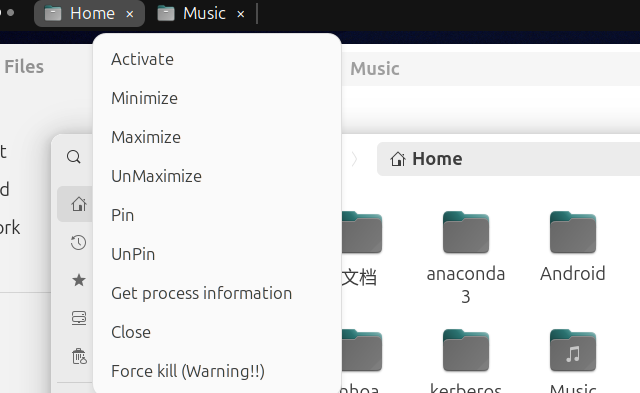
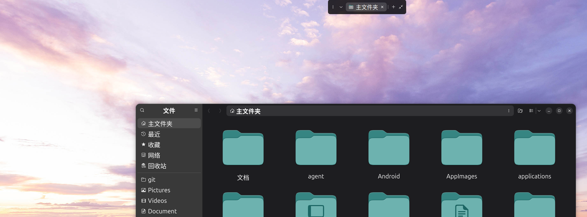

# App Tabs

[简体中文](README.zh_CN.md)

Panel mode — tabs live in the top bar:



Standalone mode — a floating tab bar above your windows (top bar can be hidden):



## Overview

**App Tabs** is a GNOME Shell extension that shows one tab per window for the focused application. Switch windows from the top panel or from a draggable floating bar in standalone mode.

## Installation

Clone this repository and copy it to `~/.local/share/gnome-shell/extensions/`, then enable the extension (Extensions app or `gnome-extensions enable huanghaohhoa-dev@163.com`).

```bash
glib-compile-schemas schemas/
# Alt+F2 → r  (restart Shell) or log out and back in
```

## Display modes

| Mode | Description |
|------|-------------|
| **Panel** | Tabs appear in the GNOME top bar, next to other panel items. |
| **Standalone** | Tabs move to a floating bar you can drag anywhere on screen. |

- **Default display mode** — chosen in extension preferences (panel or standalone).
- **Mode toggle** — click the display-mode button on the tab bar; right-click for per-app fixed panel or standalone mode.
- **Hide top bar in standalone** — slides the top bar away (similar to Hide Top Bar) so only the floating tabs remain.
- **Display mode transitions** — optional fade and slide animations; duration is configurable (0–2000 ms).

## Configuration

Open **Extensions → App Tabs → Settings**.

- **Panel max width**, **ellipsis on long titles**, **tabs on current workspace only**
- **Add tab** and **recent windows** buttons
- **App tab style** — JSON/CSS-like styles for default, active, hover, light and dark themes:

```json5
{
  "icon-size": 18,
  "default": {
    "default_style": {},
    "active_style": {},
    "hover_style": {}
  },
  "light_mode": {
    "default_style": {},
    "active_style": {},
    "hover_style": {}
  },
  "dark_mode": {
    "default_style": {},
    "active_style": {},
    "hover_style": {}
  }
}
```

- **Fixed standalone / panel applications** — always use one display mode for specific apps

## Features

1. See open windows as tabs for the current application.
2. Click a tab to focus that window; click the active tab to minimize.
3. Close button on each tab; right-click for window actions (pin, maximize, workspace, etc.).
4. Drag tabs to reorder; order is remembered per application.
5. **Panel** and **standalone** display modes with optional animations.
6. Recent windows menu to reopen closed windows or switch across apps.
7. **Add tab** opens a new window when the app supports it.

If something breaks or you want a change, open an issue on the repository.

## Recommended

[CoverflowAltTab](https://github.com/dsheeler/CoverflowAltTab): bind **Alt+Tab** to applications and **Alt+Grave** to windows — works well with App Tabs.

## Debug

GNOME Shell logs:

```bash
journalctl -f -o cat /usr/bin/gnome-shell
```

GNOME Shell 48 (nested):

```bash
export MUTTER_DEBUG_DUMMY_MODE_SPECS=1366x768
dbus-run-session -- gnome-shell --nested --wayland
```

GNOME Shell 49+ (devkit):

```bash
export G_MESSAGES_DEBUG=all
export MUTTER_DEBUG_DUMMY_MODE_SPECS=1366x768
export SHELL_DEBUG=all
command -V mutter-devkit || sudo apt install mutter-dev-bin
dbus-run-session gnome-shell --devkit --wayland
```

Preferences:

```bash
journalctl -f -o cat /usr/bin/gjs
gnome-extensions prefs huanghaohhoa-dev@163.com
```

Run tests:

```bash
bash scripts/check.sh
```

## Development

- https://gjs-docs.gnome.org/
- https://gjs.guide/guides/
